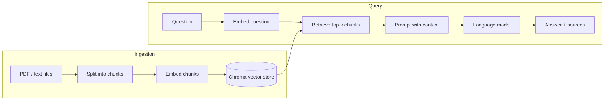

# RAG Document Q&A

A retrieval-augmented generation (RAG) service that answers questions about your
own documents and cites its sources. You add PDFs or text files; the service
retrieves the most relevant passages and grounds a language model's answer in
them, so responses are traceable to your documents rather than invented.

## How it works

The system is two pipelines that share a vector store.

**Ingestion** loads documents, splits them into overlapping chunks, embeds each
chunk, and stores the vectors on disk.

**Query** embeds the question, retrieves the most similar chunks, and passes them
to the language model with an instruction to answer only from that context. Each
answer is returned with the source of the chunks it drew on.



## Tech stack

- **FastAPI** for the HTTP API
- **LangChain** for document splitting and the retrieval/generation flow
- **Chroma** as the vector store
- **Google Gemini** for embeddings and generation
- **pydantic-settings** for configuration

The embedding and language models are selected through configuration, so the
service can be pointed at a different provider (for example, Azure OpenAI) by
changing environment variables rather than code.

## Project structure

```
rag-doc-qa/
├── app/
│   ├── main.py          # FastAPI app and routes
│   ├── config.py        # settings (pydantic-settings)
│   ├── schemas.py       # request/response models
│   ├── providers.py     # embedding and LLM factories
│   ├── ingest.py        # load and chunk documents
│   ├── vectorstore.py   # build and load the Chroma index
│   └── rag.py           # retrieval and grounded answering
├── data/                # source documents
├── tests/
├── requirements.txt
├── requirements-dev.txt
└── .env.example
```

## Getting started

Requires Python 3.11+ and a Google AI Studio API key (free, no card required).

1. Create and activate a virtual environment, then install dependencies:

   ```
   python -m venv .venv
   .venv\Scripts\activate          # Windows
   # source .venv/bin/activate     # macOS / Linux
   pip install -r requirements.txt
   ```

2. Copy `.env.example` to `.env` and set your key:

   ```
   GOOGLE_API_KEY=your_key_here
   ```

3. Add one or more PDF or text files to `data/`.

4. Build the vector index:

   ```
   python -m app.vectorstore
   ```

5. Start the API:

   ```
   python -m uvicorn app.main:app --reload
   ```

Open http://127.0.0.1:8000/docs for interactive API documentation.

## Usage

Ask a question:

```
POST /ask
{
  "question": "How does the leave policy work?"
}
```

Response:

```
{
  "answer": "Full-time employees accrue 1.5 days of paid leave per month...",
  "sources": [{"source": "policy.pdf", "page": 2}]
}
```

## Configuration

Settings live in `app/config.py` and can be overridden in `.env`. Options include
chunk size and overlap, the number of chunks retrieved per question, and the
embedding and language model names.

## Tests

```
pip install -r requirements-dev.txt
python -m pytest
```

The tests cover chunking, response parsing, and the API endpoints. They mock the
language model, so they run quickly and require no API key or network access.

## Limitations and possible improvements

- Chunking is fixed-size; structure-aware splitting could improve retrieval on
  some documents.
- There is no re-ranking step, so retrieval relies on embedding similarity alone.
- Answer quality is not formally evaluated; adding a small evaluation set
  (measuring faithfulness and context relevance) is the natural next step.
- The index is rebuilt manually; there is no incremental update when documents
  change.
- The service is single-user, with no authentication or rate limiting.
